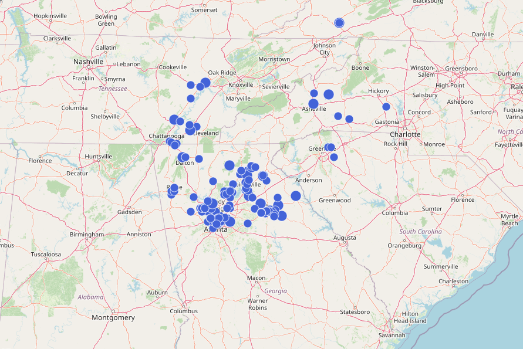

<h1>
    
</h1>

Mountain Mesh is a community group building a mesh network in the southern Appalachian Mountains. We are a group of makers, tech enthusiasts, and amateur radio operators who are passionate about building a resilient, decentralized, and community-owned communications network. You can learn more about us on our [About page](/about/).

## [MediumFast Migration](/mediumfast)

!!! warning
    On October 1, 2025, we ask that all Mountain Mesh members flip their nodes over to the MediumFast modem preset. For more information on how to set your nodes connected, see our [MediumFast setup guide](/mediumfast).

## Discord

Come chat with us! We are active on [Discord](https://discord.gg/4WN32RHGSs). This is also where we post events such as meetups.

## Map

There are two ways to check out our mesh in real time:

- [our MeshView instance](https://view.mtnme.sh/map)
- [our Malla instance](https://malla.mtnme.sh)

Here's what it looked like as of June 4th, 2025:

Both will let you get some information about what all those little dots represent, and will let you see new nodes that have come online since we last grapped a screenshot.
